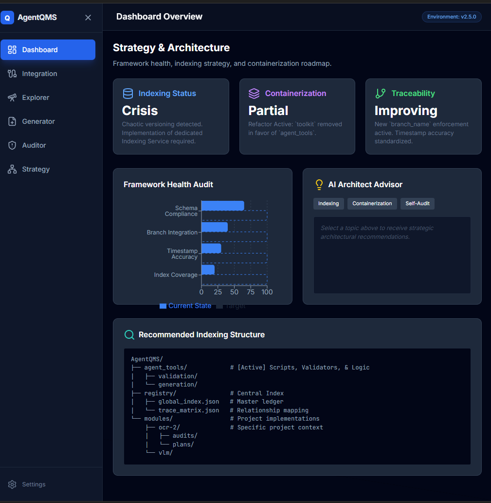
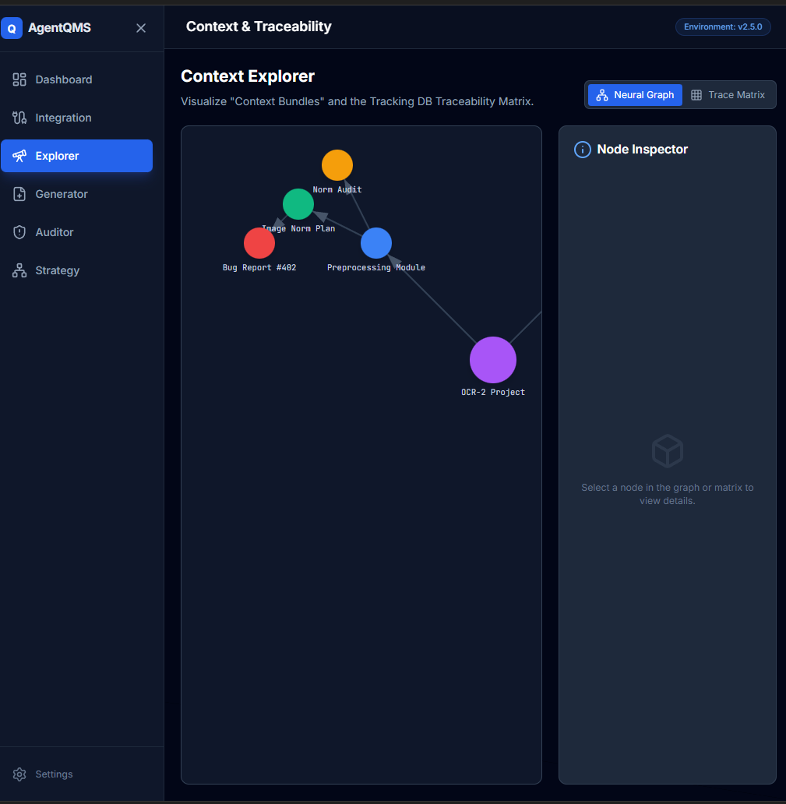
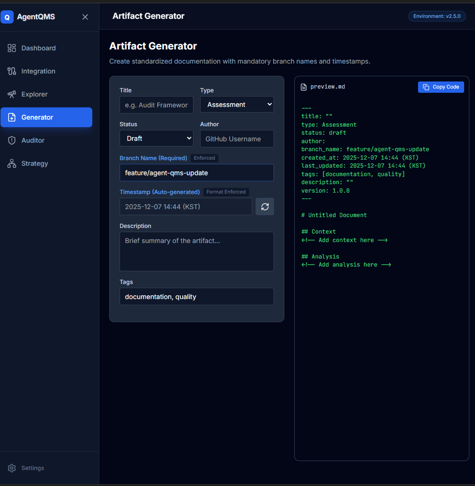
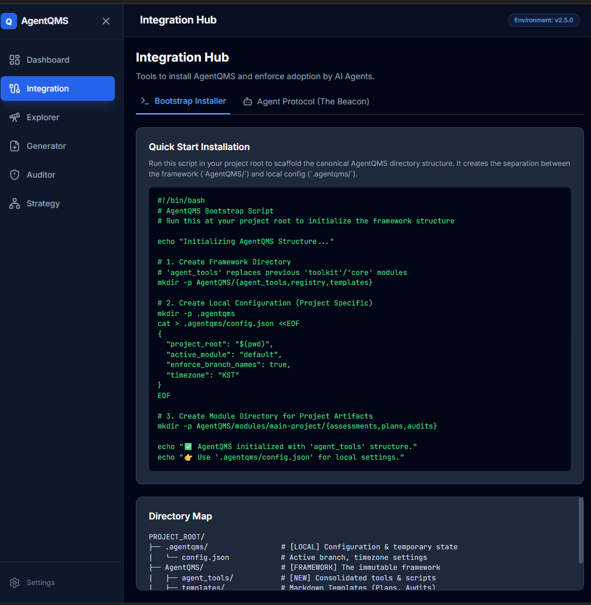

# AgentQMS Dashboard

**A React + TypeScript dashboard for AgentQMS framework artifact management and quality control**

[](https://www.typescriptlang.org/)
[](https://react.dev/)
[](https://fastapi.tiangolo.com/)
[](https://www.python.org/)

## Overview

AgentQMS Dashboard provides a modern web interface for managing documentation artifacts, running compliance checks, and monitoring the quality management framework. Built with React + TypeScript (frontend) and FastAPI (backend).

### Key Features

- **🎯 Artifact Generator**: AI-powered creation of implementation plans, assessments, audits, and bug reports
- **🔍 Framework Auditor**: Validate artifacts using AI analysis or direct Python tool execution
- **📊 Strategy Dashboard**: Framework health metrics and architectural recommendations
- **🔗 Integration Hub**: Real-time tracking status and system health monitoring
- **🌐 Context Explorer**: Visualize artifact relationships and dependencies
- **📚 Librarian**: Document discovery and management
- **🔗 Reference Manager**: Link migration and resolution tools


## App Demo Gallery

Click any screenshot to view in full size. These screens show the dashboard overview, context explorer, artifact generator, and integration hub flows. Swap in updated captures anytime by replacing the image files below.

<style>
  .screenshot-row {
    margin: 20px 0;
    text-align: center;
  }
  .screenshot-container {
    position: relative;
    display: inline-block;
    max-width: 100%;
  }
  .screenshot-img {
    max-width: 100%;
    height: auto;
    border: 1px solid #ddd;
    border-radius: 8px;
    cursor: pointer;
    transition: transform 0.2s, box-shadow 0.2s;
  }
  .screenshot-img:hover {
    transform: scale(1.02);
    box-shadow: 0 4px 12px rgba(0,0,0,0.15);
  }
  .modal {
    display: none;
    position: fixed;
    z-index: 1000;
    left: 0;
    top: 0;
    width: 100%;
    height: 100%;
    overflow: auto;
    background-color: rgba(0,0,0,0.8);
  }
  .modal-content {
    margin: auto;
    display: block;
    max-width: 90%;
    max-height: 90vh;
    padding-top: 2vh;
  }
  .modal-content {
    animation: zoomIn 0.3s;
  }
  @keyframes zoomIn {
    from { transform: scale(0.8); opacity: 0; }
    to { transform: scale(1); opacity: 1; }
  }
  .close-modal {
    position: absolute;
    top: 20px;
    right: 40px;
    color: #f1f1f1;
    font-size: 40px;
    font-weight: bold;
    cursor: pointer;
    z-index: 1001;
  }
  .close-modal:hover {
    color: #bbb;
  }
  .screenshot-title {
    font-weight: bold;
    margin-top: 16px;
    margin-bottom: 8px;
    font-size: 16px;
  }
</style>

<div class="screenshot-row">
  <div class="screenshot-title">📊 Dashboard Overview</div>
  <div class="screenshot-container">
    
  </div>
</div>

<div id="modal1" class="modal">
  <span class="close-modal" onclick="document.getElementById('modal1').style.display='none'">&times;</span>
  
</div>

<div class="screenshot-row">
  <div class="screenshot-title">🌐 Context Explorer</div>
  <div class="screenshot-container">
    
  </div>
</div>

<div id="modal2" class="modal">
  <span class="close-modal" onclick="document.getElementById('modal2').style.display='none'">&times;</span>
  
</div>

<div class="screenshot-row">
  <div class="screenshot-title">🎯 Artifact Generator</div>
  <div class="screenshot-container">
    
  </div>
</div>

<div id="modal3" class="modal">
  <span class="close-modal" onclick="document.getElementById('modal3').style.display='none'">&times;</span>
  
</div>

<div class="screenshot-row">
  <div class="screenshot-title">🔗 Integration Hub</div>
  <div class="screenshot-container">
    
  </div>
</div>

<div id="modal4" class="modal">
  <span class="close-modal" onclick="document.getElementById('modal4').style.display='none'">&times;</span>
  
</div>

<script>
  // Click to open modal functionality
  document.getElementById('img1').onclick = function() { document.getElementById('modal1').style.display = 'block'; }
  document.getElementById('img2').onclick = function() { document.getElementById('modal2').style.display = 'block'; }
  document.getElementById('img3').onclick = function() { document.getElementById('modal3').style.display = 'block'; }
  document.getElementById('img4').onclick = function() { document.getElementById('modal4').style.display = 'block'; }
  
  // Click outside modal to close
  window.onclick = function(event) {
    let modals = document.querySelectorAll('.modal');
    modals.forEach(function(modal) {
      if (event.target == modal) {
        modal.style.display = 'none';
      }
    });
  }
  
  // ESC key to close modal
  document.addEventListener('keydown', function(event) {
    if (event.key === 'Escape') {
      let modals = document.querySelectorAll('.modal');
      modals.forEach(function(modal) {
        modal.style.display = 'none';
      });
    }
  });
</script>


## Quick Start

### Prerequisites

- **Python 3.11.14** (via pyenv recommended)
- **Node.js 18+** (for frontend)
- **uv** (Python package manager)

### Installation & Development

```bash
# Install all dependencies (frontend + backend)
make install

# Start both servers
make dev

# Or start individually
make dev-frontend  # Port 3000
make dev-backend   # Port 8000
```

Access the dashboard at **http://localhost:3000**

### Available Commands

```bash
# Development
make dev                    # Start both servers
make dev-frontend           # Frontend only (port 3000)
make dev-backend            # Backend only (port 8000)
make restart-servers        # Restart both servers

# Quality & Testing
make test                   # Run all tests
make lint                   # Lint code
make format                 # Format code
make validate               # Validate artifacts (via AgentQMS)

# Utilities
make status                 # Check server status
make clean                  # Remove generated files
make help                   # Show all commands
```

## Project Structure

```
apps/agentqms-dashboard/
├── frontend/              # React TypeScript app (Vite)
│   ├── components/        # 15 React components
│   ├── services/          # API integration (aiService, bridgeService)
│   ├── config/            # Configuration constants
│   └── docs/              # Detailed documentation
├── backend/               # FastAPI server
│   ├── routes/            # 5 API route modules
│   │   ├── artifacts.py   # Artifact CRUD
│   │   ├── compliance.py  # Validation checks
│   │   ├── system.py      # Health checks
│   │   ├── tools.py       # Tool execution
│   │   └── tracking.py    # Tracking DB access
│   ├── server.py          # Main FastAPI app
│   └── fs_utils.py        # File system utilities
└── Makefile               # Development commands
```

## Architecture

### Frontend (Port 3000)
- **Framework**: React 19.2 + TypeScript
- **Build**: Vite 7.x
- **UI**: Tailwind CSS (CDN for development)
- **State**: Local state with hooks
- **API Client**: Axios via bridgeService

### Backend (Port 8000)
- **Framework**: FastAPI + Uvicorn
- **Language**: Python 3.11.14
- **Package Manager**: uv
- **API**: RESTful with OpenAPI docs at `/docs`
- **CORS**: Configured for localhost:3000

### Integration
- Frontend proxies `/api` requests to backend (Vite proxy)
- Backend executes AgentQMS tools via subprocess
- Tracking database provides real-time status
- File system operations via `fs_utils.py`

## API Documentation

Once the backend is running, access interactive API docs:
- **Swagger UI**: http://localhost:8000/docs
- **ReDoc**: http://localhost:8000/redoc

### Key Endpoints

```
GET  /api/v1/health              # System health check
GET  /api/v1/tracking/status     # Tracking DB status
POST /api/v1/tools/exec          # Execute AgentQMS tool
GET  /api/v1/artifacts/list      # List artifacts
GET  /api/v1/compliance/check    # Run compliance checks
```

## Configuration

### Environment Variables

Create `frontend/.env.local`:
```bash
GEMINI_API_KEY=your_api_key_here
```

### Python Environment

The Makefile uses Python 3.11.14 specifically:
```bash
PYTHON := /home/vscode/.pyenv/versions/3.11.14/bin/python
```

Configure in your environment or update Makefile if using a different Python.

## Development Workflow

1. **Install dependencies**: `make install`
2. **Start development servers**: `make dev`
3. **Make changes**: Frontend hot-reloads, backend requires restart
4. **Validate**: `make lint && make validate`
5. **Test**: `make test`

## Troubleshooting

### Port Conflicts
```bash
# Check what's running
make status

# Stop all servers
make stop-servers
```

### Backend Connection Issues
- Verify backend is on port 8000: `lsof -i :8000`
- Check Vite proxy config in `frontend/vite.config.ts`
- CORS settings in `backend/server.py`

### Validation Warnings
The boundary check may warn about legacy directories - this is expected. See `CONSOLE_WARNINGS_RESOLUTION.md` for details.

## Documentation

- **Frontend Details**: [frontend/README.md](frontend/README.md)
- **Architecture**: [frontend/docs/architecture/](frontend/docs/architecture/)
- **API Contracts**: [frontend/docs/api/](frontend/docs/api/)
- **Development Plans**: [frontend/docs/plans/](frontend/docs/plans/)
- **Console Issues**: [CONSOLE_WARNINGS_RESOLUTION.md](CONSOLE_WARNINGS_RESOLUTION.md)

## Implementation Status

**Phase 1-3: ✅ COMPLETE** (as of 2025-12-11)
- ✅ Frontend dashboard with 7 functional pages
- ✅ Backend API with 5 route modules
- ✅ Tool execution integration
- ✅ Tracking database integration
- ✅ Development tooling (Makefile, configs)

**Phase 4: ⏳ IN PROGRESS**
- ⏳ Automated integration tests
- ⏳ Deployment configuration
- ⏳ Authentication/authorization
- ⏳ Performance optimization

See [frontend/docs/plans/](frontend/docs/plans/) for detailed implementation history.

## Contributing

This dashboard is part of the AgentQMS framework. Follow AgentQMS conventions:
- Artifact naming: `YYYY-MM-DD_HHMM_{TYPE}_description.md`
- Frontmatter validation required
- Boundary enforcement (AgentQMS/ vs docs/)

Run `make validate` before committing.

## License

Part of the AgentQMS project - see main repository for license details.

---

**Built with**: React 19.2 • TypeScript 5.6 • Vite 7.x • FastAPI • Python 3.11.14
