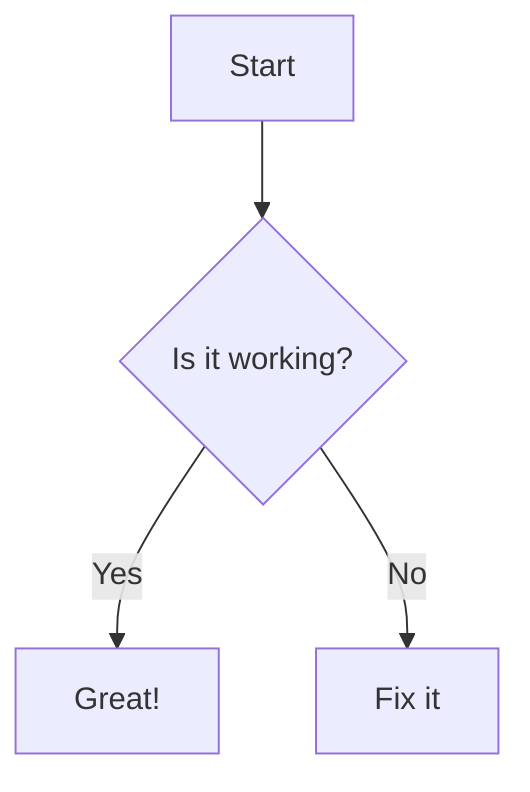

# Markdown Feature Test

## 1. Frontmatter
The section above should be hidden or formatted nicely, not shown as a horizontal rule.

## 2. Admonitions (GitHub Alerts)

> [!NOTE]
> This is a note.

> [!IMPORTANT]
> This is important information.

> [!WARNING]
> This is a warning.

## 3. Syntax Highlighting

```python
def hello_world():
    print("Hello, world!")
    return True
```

```javascript
const app = () => {
    return console.log('React is cool');
}
```

## 4. Mermaid Diagram



## 5. Math

Lift($L$) can be determined by $L = \frac{1}{2} \rho v^2 S C_L$